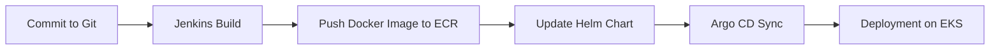

# Практичне завдання: Terraform + EKS + Helm (Lesson 7)

У цьому завданні ми розгорнемо у AWS:

1. **ECR** для зберігання Docker-образу Django  
2. **EKS (Elastic Kubernetes Service)** у нашій VPC  
3. **Helm-чарт** з Deployment, Service, ConfigMap та HPA  

---

## 📋 Передумови

- Встановлені:
  - [Terraform ≥ 1.6](https://terraform.io/downloads)
  - [AWS CLI](https://docs.aws.amazon.com/cli/latest/userguide/cli-chap-install.html)
  - [kubectl](https://kubernetes.io/docs/tasks/tools/)
  - [Helm 3](https://helm.sh/docs/intro/install/)
- Налаштований AWS профіль із правами:
  - S3, DynamoDB (для бекенду Terraform)
  - VPC, EC2, IAM, ECR, EKS
- У консолі:
  ```bash
  aws configure
  # AWS_ACCESS_KEY_ID, AWS_SECRET_ACCESS_KEY, default region → ap-southeast-1

## 🗂️ Структура проєкту

  ```
lesson-7/
├── main.tf
├── backend.tf
├── outputs.tf
├── modules/
│   ├── s3-backend/
│   ├── vpc/
│   ├── ecr/
│   └── eks/
└── charts/
    └── django-app/
        ├── Chart.yaml
        ├── values.yaml
        └── templates/
            ├── deployment.yaml
            ├── service.yaml
            ├── configmap.yaml
            └── hpa.yaml

```

## 🚀 Крок 1. Ініціалізація Terraform
1.	Перейдіть у каталог:

```
cd lesson-7
```

2.	Ініціалізуйте бекенд і модулі:

⚠️ Щоб уникнути помилок типу `NoSuchBucket` або `AccessDenied`, дотримуйтесь цієї послідовності:

**Перед першим запуском** — `закоментуйте` або `перейменуйте` файл `backend.tf`.
```
terraform init
```

3.	Перевірте план:
```
terraform plan
```
4.	Застосуйте зміни:
```
terraform apply
```
`# введіть "yes" для підтвердження`

## 🐳 Крок 2. Збірка і завантаження Docker-образу
1.	Авторизуйтесь в ECR:
```
aws ecr get-login-password \
  --region ap-southeast-1 \
| docker login --username AWS --password-stdin $(terraform output -raw ecr_repo_url)
```

2.	Зберіть образ:
```
docker build -t django-app ./django
```

3.	Присвойте тег і запуште:
```
docker tag django-app:latest \
  $(terraform output -raw ecr_repo_url):latest

docker push $(terraform output -raw ecr_repo_url):latest
```

## 🔐 Авторизація до ECR (imagePullSecrets)

Якщо ваш ECR-репозиторій приватний, створіть Kubernetes Secret для доступу:

```bash
kubectl create secret docker-registry ecr-registry \
  --docker-server=$(terraform output -raw ecr_repo_url) \
  --docker-username AWS \
  --docker-password=$(aws ecr get-login-password --region ap-southeast-1) \
  --docker-email=you@example.com
```

Переконайтеся, що в `charts/django-app/templates/deployment.yaml` є блок:

```yaml
    spec:
      imagePullSecrets:
        - name: ecr-registry
```

## 🔧 Крок 3. Підключення до EKS

Отримайте kubeconfig і перевірте ноди:
```
aws eks update-kubeconfig \
  --region ap-southeast-1 \
  --name $(terraform output -raw eks_cluster_name)

kubectl get nodes
```

## 🏗️ Крок 4. Розгортання Helm-чарту
1.	Перейдіть у каталог чарта:
```
cd charts/django-app
```

2.	Встановіть чарт:
```
helm install django-app .
```

3.	(Після змін) Оновіть чарт:
```
helm upgrade django-app .
```

## 🔎 Перевірка
-	Ноди
``` 
kubectl get nodes
```

- Deployment & Pods
```
kubectl get deployments
kubectl get pods
```

- Service
```
kubectl get svc
```
`# знайдіть EXTERNAL-IP для доступу`

- HPA
```
kubectl get hpa
```

- ConfigMap
```
kubectl describe configmap django-app-config
```

- **Metrics-server**  
  Якщо HPA показує `<unknown>/70%`, встановіть metrics-server:

  ```bash
  kubectl apply -f https://github.com/kubernetes-sigs/metrics-server/releases/latest/download/components.yaml
  ```
  Або через Helm:
  ```bash
  helm repo add metrics-server https://kubernetes-sigs.github.io/metrics-server/
  helm install metrics-server metrics-server/metrics-server \
    --namespace kube-system \
    --set args={--kubelet-insecure-tls}
  ```
  Почекайте ~1 хв, потім перевірте `kubectl get hpa django-app-hpa`.

## 🧹 Очищення

1.	Видаліть Helm-реліз:
```
helm uninstall django-app
```

2.	Зруйнуйте інфраструктуру Terraform:
```
terraform destroy -auto-approve
```
⚠️ Після destroy S3-бакет із версіонуванням може залишити об’єкти. Щоб його видалити, доведеться очистити всі версії вручну або використати force_destroy = true в ресурсі.

3.	(За потреби) Очистіть S3-бакет із версіями:
```
aws s3api delete-objects … 
aws s3api delete-bucket --bucket terraform-state-bucket-… 
```

## 🔄 CI/CD Pipeline

У цьому проєкті реалізовано CI/CD pipeline, який автоматизує процес розгортання: від коміту коду до оновлення додатку в Kubernetes.

Основні етапи pipeline:

- Commit → Jenkins build → ECR push → Helm chart update → Argo CD sync → Deployment



### Команди для тестування CI/CD

- Запустити Jenkins job через Webhook або вручну.
- Перевірити наявність образу в ECR.
- Переглянути логи збірки Jenkins.
- Перевірити статус Argo CD додатку:
  ```bash
  kubectl get applications.argoproj.io
  ```
- Примусово синхронізувати додаток через Argo CD CLI:
  ```bash
  argocd app sync django-app
  ```

# ✏️ Порада ⚠️:
Щоб уникнути `“завислого”` бекенду при першому розгортанні, закоментуйте `backend.tf`, `зробіть terraform apply`, а потім розкоментуйте і запустіть `terraform init -reconfigure`.

Після кожного пушу в Git workflow автоматично запускається повний CI/CD цикл.

Успішного розгортання! 🚀