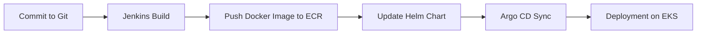

# Домашнє завдання: Створення гнучкого Terraform-модуля для баз даних

Ви вже знаєте, як автоматизується інфраструктура за допомогою Terraform. Але справжній DevOps — це не тільки шаблони, а гнучкі, багаторазові модулі, які працюють у будь-якому середовищі.

Цього разу ви створите продакшн-готовий Terraform-модуль, який може створювати:

Звичайну RDS-базу (PostgreSQL / MySQL)
Або Aurora-кластер, залежно від прапора use_aurora = true
Це завдання навчить вас працювати з умовною логікою в Terraform, залежностями між ресурсами та структурованими змінними.
---

## 📋 Передумови

- Встановлені:
  - [Terraform ≥ 1.6](https://terraform.io/downloads)
  - [AWS CLI](https://docs.aws.amazon.com/cli/latest/userguide/cli-chap-install.html)
  - [kubectl](https://kubernetes.io/docs/tasks/tools/)
  - [Helm 3](https://helm.sh/docs/intro/install/)
- Налаштований AWS профіль із правами:
  - S3, DynamoDB (для бекенду Terraform)
  - VPC, EC2, IAM, ECR, EKS
- У консолі:
  ```bash
  aws configure
  # AWS_ACCESS_KEY_ID, AWS_SECRET_ACCESS_KEY, default region → ap-southeast-1

## 🗂️ Структура проєкту

```
my-microservice-project/
├── main.tf
├── backend.tf
├── outputs.tf
├── modules/
│   ├── s3-backend/
│   ├── vpc/
│   ├── ecr/
│   ├── eks/
│   ├── rds/
│   ├── jenkins/
│   └── argo_cd/
└── charts/
    └── django-app/
        ├── Chart.yaml
        ├── values.yaml
        └── templates/
            ├── deployment.yaml
            ├── service.yaml
            ├── configmap.yaml
            └── hpa.yaml
```

Кожен модуль виконує:
- `s3-backend` — налаштування S3-бакету та DynamoDB для зберігання стану Terraform.
- `vpc` — створення VPC, підмереж, маршрутизації та Internet Gateway.
- `ecr` — створення ECR-репозиторію для Docker-образів.
- `eks` — розгортання EKS-кластера та CSI-драйверів.
- `rds` — модуль для створення Amazon RDS або Aurora (PostgreSQL/MySQL).
- `jenkins` — модуль для встановлення Jenkins через Helm з JCasC та IRSA.
- `argo_cd` — модуль для встановлення Argo CD через Helm та створення Application-карт.
- `charts/django-app` — Helm-чарт для деплою Django-додатку (Deployment, Service, ConfigMap, HPA).

## 🚀 Крок 1. Ініціалізація Terraform
1.	Перейдіть у каталог:

```
cd lesson-7
```

2.	Ініціалізуйте бекенд і модулі:

⚠️ Щоб уникнути помилок типу `NoSuchBucket` або `AccessDenied`, дотримуйтесь цієї послідовності:

**Перед першим запуском** — `закоментуйте` або `перейменуйте` файл `backend.tf`.
```
terraform init
```

3.	Перевірте план:
```
terraform plan
```
4.	Застосуйте зміни:
```
terraform apply
```
`# введіть "yes" для підтвердження`

## 🐳 Крок 2. Збірка і завантаження Docker-образу
1.	Авторизуйтесь в ECR:
```
aws ecr get-login-password \
  --region ap-southeast-1 \
| docker login --username AWS --password-stdin $(terraform output -raw ecr_repo_url)
```

2.	Зберіть образ:
```
docker build -t django-app ./django
```

3.	Присвойте тег і запуште:
```
docker tag django-app:latest \
  $(terraform output -raw ecr_repo_url):latest

docker push $(terraform output -raw ecr_repo_url):latest
```

## 🔐 Авторизація до ECR (imagePullSecrets)

Якщо ваш ECR-репозиторій приватний, створіть Kubernetes Secret для доступу:

```bash
kubectl create secret docker-registry ecr-registry \
  --docker-server=$(terraform output -raw ecr_repo_url) \
  --docker-username AWS \
  --docker-password=$(aws ecr get-login-password --region ap-southeast-1) \
  --docker-email=you@example.com
```

Переконайтеся, що в `charts/django-app/templates/deployment.yaml` є блок:

```yaml
    spec:
      imagePullSecrets:
        - name: ecr-registry
```

## 🔧 Крок 3. Підключення до EKS

Отримайте kubeconfig і перевірте ноди:
```
aws eks update-kubeconfig \
  --region ap-southeast-1 \
  --name $(terraform output -raw eks_cluster_name)

kubectl get nodes
```

## 🏗️ Крок 4. Розгортання Helm-чарту
1.	Перейдіть у каталог чарта:
```
cd charts/django-app
```

2.	Встановіть чарт:
```
helm install django-app .
```

3.	(Після змін) Оновіть чарт:
```
helm upgrade django-app .
```

## 🔎 Перевірка
-	Ноди
``` 
kubectl get nodes
```

- Deployment & Pods
```
kubectl get deployments
kubectl get pods
```

- Service
```
kubectl get svc
```
`# знайдіть EXTERNAL-IP для доступу`

- HPA
```
kubectl get hpa
```

- ConfigMap
```
kubectl describe configmap django-app-config
```

- **Metrics-server**  
  Якщо HPA показує `<unknown>/70%`, встановіть metrics-server:

  ```bash
  kubectl apply -f https://github.com/kubernetes-sigs/metrics-server/releases/latest/download/components.yaml
  ```
  Або через Helm:
  ```bash
  helm repo add metrics-server https://kubernetes-sigs.github.io/metrics-server/
  helm install metrics-server metrics-server/metrics-server \
    --namespace kube-system \
    --set args={--kubelet-insecure-tls}
  ```
  Почекайте ~1 хв, потім перевірте `kubectl get hpa django-app-hpa`.

## 🧹 Очищення

1.	Видаліть Helm-реліз:
```
helm uninstall django-app
```

2.	Зруйнуйте інфраструктуру Terraform:
```
terraform destroy -auto-approve
```
⚠️ Після destroy S3-бакет із версіонуванням може залишити об’єкти. Щоб його видалити, доведеться очистити всі версії вручну або використати force_destroy = true в ресурсі.

3.	(За потреби) Очистіть S3-бакет із версіями:
```
aws s3api delete-objects … 
aws s3api delete-bucket --bucket terraform-state-bucket-… 
```

## 🔄 CI/CD Pipeline

У цьому проєкті реалізовано CI/CD pipeline, який автоматизує процес розгортання: від коміту коду до оновлення додатку в Kubernetes.

Основні етапи pipeline:

- Commit → Jenkins build → ECR push → Helm chart update → Argo CD sync → Deployment



### Команди для тестування CI/CD

- Запустити Jenkins job через Webhook або вручну.
- Перевірити наявність образу в ECR.
- Переглянути логи збірки Jenkins.
- Перевірити статус Argo CD додатку:
  ```bash
  kubectl get applications.argoproj.io
  ```
- Примусово синхронізувати додаток через Argo CD CLI:
  ```bash
  argocd app sync django-app
  ```

# ✏️ Порада ⚠️:
Щоб уникнути `“завислого”` бекенду при першому розгортанні, закоментуйте `backend.tf`, `зробіть terraform apply`, а потім розкоментуйте і запустіть `terraform init -reconfigure`.

Після кожного пушу в Git workflow автоматично запускається повний CI/CD цикл.

Успішного розгортання! 🚀

---

## 📦 Приклад використання модуля RDS

```hcl
module "rds" {
  source                       = "./modules/rds"
  name                         = "myapp-db"
  use_aurora                   = false
  engine                       = "postgres"
  engine_version               = "17.2"
  parameter_group_family_rds   = "postgres17"
  engine_cluster               = "aurora-postgresql"
  engine_version_cluster       = "15.3"
  parameter_group_family_aurora= "aurora-postgresql15"
  instance_class               = "db.t3.medium"
  allocated_storage            = 20
  db_name                      = "myapp"
  username                     = "postgres"
  password                     = "admin123AWS23"
  subnet_private_ids           = module.vpc.private_subnets
  subnet_public_ids            = module.vpc.public_subnets
  vpc_id                       = module.vpc.vpc_id
  publicly_accessible          = true
  multi_az                     = true
  backup_retention_period      = 7
  parameters = {
    max_connections            = "200"
    log_min_duration_statement = "500"
  }
  tags = {
    Environment = "dev"
    Project     = "myapp"
  }
}
```

## 📄 Опис змінних модуля RDS

| Змінна                            | Тип           | Опис                                                                                                      | Значення за замовчуванням        |
|-----------------------------------|---------------|------------------------------------------------------------------------------------------------------------|----------------------------------|
| `name`                            | string        | Ім'я інстансу або кластера RDS/Aurora.                                                                      | n/a                              |
| `use_aurora`                      | bool          | Якщо `true`, створюється Aurora Cluster; якщо `false` — звичайний RDS instance.                             | `false`                          |
| `engine`                          | string        | Тип БД для звичайної RDS: `"postgres"` або `"mysql"`. Для Aurora не використовується.                        | `"postgres"`                     |
| `engine_version`                  | string        | Версія движка для звичайної RDS (наприклад, `"17.2"`).                                                      | (див. variables.tf)              |
| `parameter_group_family_rds`      | string        | Родина параметр-групи для RDS (наприклад, `"postgres17"` для PostgreSQL 17).                                | (див. variables.tf)              |
| `engine_cluster`                  | string        | Тип движка для Aurora cluster: `"aurora-postgresql"` або `"aurora-mysql"`.                                  | `"aurora-postgresql"`            |
| `engine_version_cluster`          | string        | Версія движка для Aurora cluster (наприклад, `"15.3"`).                                                     | (див. variables.tf)              |
| `parameter_group_family_aurora`   | string        | Родина параметр-групи для Aurora (наприклад, `"aurora-postgresql15"`).                                      | (див. variables.tf)              |
| `instance_class`                  | string        | Клас інстансу БД (наприклад, `"db.t3.medium"`, `"db.r6g.large"`).                                           | `"db.t3.micro"`                  |
| `allocated_storage`               | number        | Обсяг дискового простору в ГБ для звичайної RDS.                                                            | `20`                             |
| `db_name`                         | string        | Ім'я бази даних, що створюється в інстансі/кластері.                                                        | n/a                              |
| `username`                        | string        | Ім'я адміністратора БД.                                                                                     | n/a                              |
| `password`                        | string (sensitive) | Пароль адміністратора БД.                                                                                   | n/a                              |
| `subnet_private_ids`              | list(string)  | Список приватних subnet IDs для розміщення інстансу/читачів Aurora.                                        | n/a                              |
| `subnet_public_ids`               | list(string)  | Список публічних subnet IDs для розміщення при `publicly_accessible=true`.                                   | n/a                              |
| `vpc_id`                          | string        | ID VPC, в якому створюється БД.                                                                              | n/a                              |
| `publicly_accessible`             | bool          | Визначає доступність інстансу з інтернету.                                                                   | `false`                          |
| `multi_az`                        | bool          | Використовувати Multi-AZ розгортання (резервна репліка в іншій AZ).                                         | `false`                          |
| `backup_retention_period`         | number        | Кількість днів зберігання автоматичних резервних копій.                                                     | `0`                              |
| `parameters`                      | map(string)   | Додаткові параметри движка (наприклад, `max_connections`).                                                  | `{}`                             |
| `tags`                            | map(string)   | Теги для всіх ресурсів модуля.                                                                              | `{}`                             |

## 🔧 Як змінити тип БД, engine та клас інстансу

У блоці `module "rds" { ... }` просто відредагуйте:
- `use_aurora` — переключає між RDS (`false`) та Aurora (`true`).
- `engine` та `engine_version` — для звичайної RDS.
- `engine_cluster` та `engine_version_cluster` — для Aurora.
- `instance_class` — задає апаратний клас інстансу (наприклад, `db.t3.large`, `db.r6g.large`).
- `allocated_storage` — обсяг дискового простору (для RDS).
- Інші змінні можна міняти за аналогією.

Такі зміни достатньо зберегти та виконати `terraform apply` для оновлення інфраструктури.